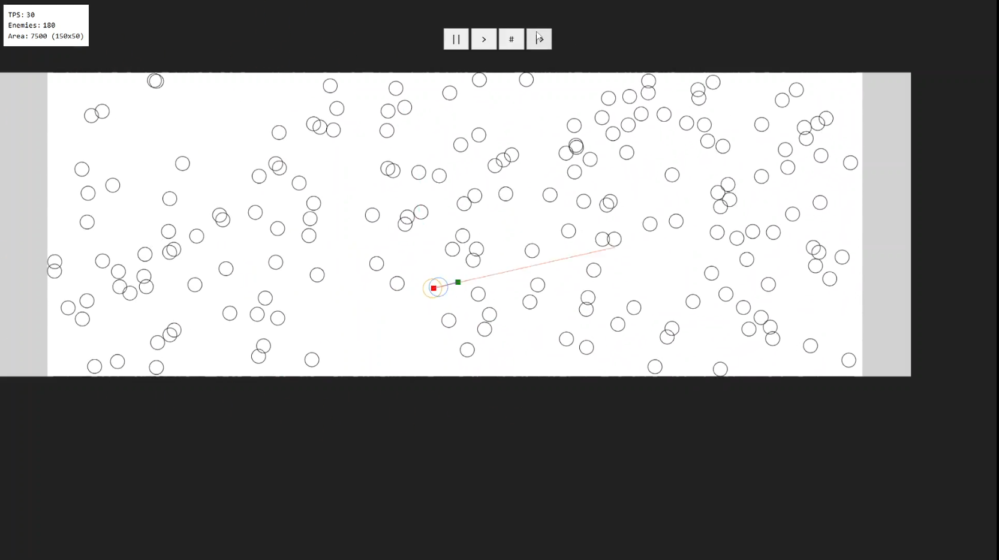

# 2D Any-Angle Pathfinding in Dynamic Environments

A playground for real-time navigation in a dense, fully dynamic 2D world.  

## Features

- Custom built JS game environment, with frame advance, path visualization, and configurable areas
- Any-angle global planner (Theta*) on an 8-connected grid
- Local planner implements unconstrained pure pursuit with Velocity Obstacles
- Finite time Velocity Obstacles guarantees local short-term safety
- Discrete velocity sampling selects a safe velocity given a preferred input heading from pure pursuit
- Tunable parameters: speeds, radii, global horizon, local horizon, safety margin, and replan windows (soon).

## High Level Game Loop

[Game State @ frame t]
- Build the set of blocked nodes covered by enemies
- Run horizon-bounded Theta* to get a global path
- Run pure pursuit on the generated path to get a preferred heading
- Build finite VOs from all moving discs (time horizon tau)
- If safe, proceed with that heading
- Else, pick a safe velocity closest in angle to the preferred heading
- Execute movement
- Enemy positions are updated
- Collision is checked between agent and enemies

The global layer provides topological guidance, while the local VO layer guarantees short-term safety. Extra logic keeps the two layers from “fighting” in crowded scenes.

## Demonstration

